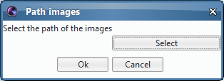
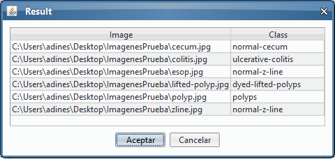

# DeepClas4BioIcyKvasir

DeepClas4BioIcyKvasir is an Icy plugin that allows users to classify a batch of images using a model trained in the Kvasir dataset, a gastrointestinal disease dataset.

## Requirements
To use this plugin is necessary to have installed Icy with Java 8 and the [DeepClas4Bio API](https://github.com/adines/DeepClas4Bio).

## Installation
This plugin is updated in the Icy repository and the recommendable way to install it is download the plugin using the Icy repository.

## About the model
This plugin use a PyTorch model, the ResNet34 model, trained in the Kvasir dataset. The steps we have followed to train this model can be found in the following [Colab Notebook](https://colab.research.google.com/drive/1qOsAEWp3KfIX-AMDj-9_VZfGrtbiEeCF).

## Using the plugin
In this section, we will see an example of how to use this plugin.

To use the plugin you must follow the following steps:

 1. Run the plugin
 
 Go to Plugins and search DeepClas4BioIcyKvasir

 2. Select the folder with the images you want classify
 
 

 
 3. Visualize the output
 
 
